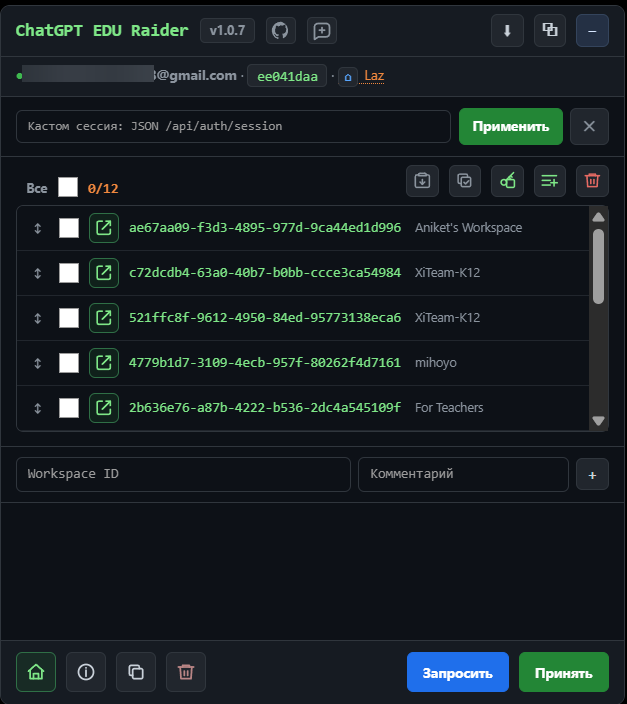

# ChatGPT EDU Raider 1.0.7

Userscript для управления ChatGPT EDU/workspace ID прямо на страницах ChatGPT.



## Возможности

- Ведение списка workspace ID с комментариями, выбором, импортом, копированием, удалением и drag-and-drop сортировкой.
- Запрос доступа и принятие инвайтов для выбранных workspace ID с фиксированной параллельностью в 5 потоков.
- Автоопределение текущей `/api/auth/session`, аккаунта, типа аккаунта и активного workspace.
- Отметка workspace, доступных для переключения из текущей учётки, отдельной иконкой.
- API-переключение в доступные workspace и обратно в личный аккаунт через кнопку с домиком.
- Сбор и копирование `accessToken` для выбранных доступных workspace без полного переключения аккаунта.
- Иконки статуса для workspace, к которым аккаунт не подключен, и для деактивированных workspace.
- Просмотр информации по workspace: настройки, пользователи, инвайты, лимиты, флаги и доступные модели.
- Копирование полного JSON `/api/auth/session` и экспорт сессии в файл.
- Копирование и очистка лога панели.

## Как пользоваться

1. Откройте `https://chatgpt.com/`.
2. Убедитесь, что в панели есть нужные workspace ID.
3. Нажмите `Все`, чтобы выбрать все записи.
4. Нажмите `Запросить` и дождитесь завершения.
5. Нажмите `Принять` и дождитесь завершения.
6. Обновите страницу.
7. Перейдите в каждую добавленную группу.
8. В каждой группе нажмите `Скопировать сессию`.
9. Вставьте скопированный JSON `/api/auth/session` в [`jlcodes99/cockpit-tools`](https://github.com/jlcodes99/cockpit-tools) для дальнейшей работы с Codex.

## Установка

1. Установите менеджер userscript, например ScriptCat, Tampermonkey или Violentmonkey.
2. Откройте прямую ссылку: [установить ChatGPT EDU Raider](https://github.com/CriDos/ChatGPT_EDU_Raider/raw/refs/heads/master/chatgpt-edu-raider.user.js).
3. Подтвердите установку, когда менеджер userscript откроет окно установки.
4. Откройте `https://chatgpt.com/`.
5. Используйте панель `ChatGPT EDU Raider`.

## Основные Действия

- `Вставить`: импортировать записи из буфера обмена.
- `Копировать`: скопировать выбранные записи.
- `Скопировать accessToken для выбранных workspace`: собрать accessToken для отмеченных доступных workspace и скопировать их через перенос строки.
- `Добавить дефолтные workspace`: добавить недостающие дефолтные workspace ID без очистки текущего списка.
- `Удалить`: удалить выбранные записи после подтверждения.
- `Домик`: переключиться на личный аккаунт.
- `Обзор`: открыть обзор текущего workspace.
- `Скопировать лог`: скопировать текущий лог панели.
- `Очистить лог`: очистить лог панели.
- `Запросить`: отправить запросы на вступление для выбранных записей.
- `Принять`: принять инвайты для выбранных записей.
- `Скопировать сессию`: скопировать полный JSON `/api/auth/session`.
- `Экспорт сессии`: скачать данные сессии в JSON.

## Формат Записей

Обычный текстовый формат для импорта и копирования:

```text
workspace-id|комментарий
workspace-id|комментарий
```

Комментарий можно не указывать:

```text
workspace-id
```

Несколько ID без комментариев можно вставлять через пробелы, запятые или новые строки.
